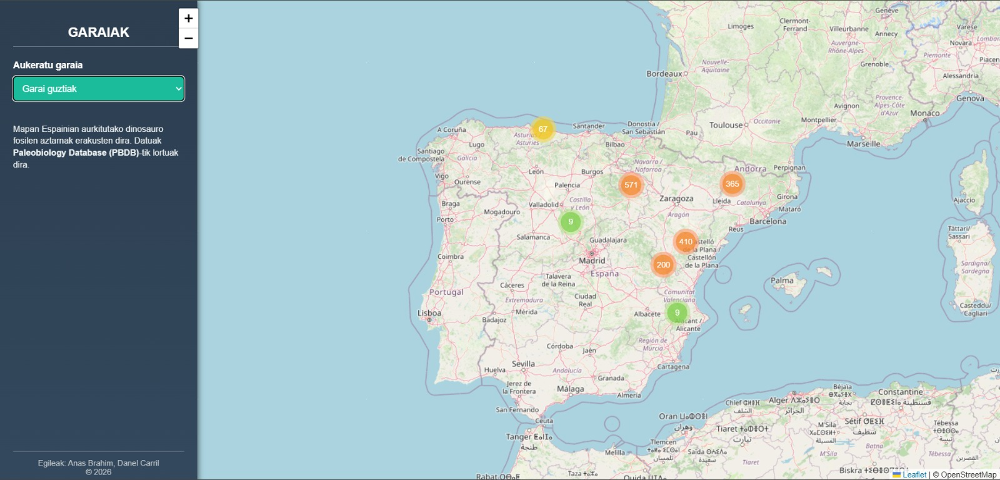

# 🦖 Dinosaurioak Espainian – Leaflet + PBDB

Proiektu honen helburua **Geolokalizazioa** irakasgaian ikasitakoa praktikan jartzea izan da, **Leaflet** mapa-liburutegia erabiliz eta **kanpoko API** baten bidez lortutako datuak geolokalizatuz.

Web aplikazio honek **Espainian aurkitutako dinosauroen erregistro paleontologikoak** erakusten ditu, **Paleobiology Database (PBDB)** API-tik eskuratutako informazioarekin.

## Aurkibidea
- [Helburua](#helburua)
- [Funtzionalitateak](#funtzionalitateak)
- [🖼️ Irudiak](#🖼️-irudiak)
  - [🗺️ Mapa interaktiboa](#🗺️-mapa-interaktiboa)
  - [📍 Markatzaile baten informazioa](#📍-markatzaile-baten-informazioa)
  - [📊 Alboko menua](#📊-alboko-menua)
- [Erabilitako Teknologiak](#erabilitako-teknologiak)
- [API erabilera](#api-erabilera)
- [Erabilera](#erabilera)
- [Egindako hobekuntzak](#egindako-hobekuntzak)
- [Egileak](#egileak)

---

## Helburua

- Leaflet erabiliz mapa interaktibo bat sortzea  
- API baten bidez datuak eskuratzea  
- Koordenatu geografikoak dituzten puntuak mapan kokatzea  
- Geolokalizazioaren erabilera praktikoa lantzea  

## Funtzionalitateak

- Espainiako mapa interaktiboa (OpenStreetMap + Leaflet)
- Dinosauroen aurkikuntza-puntuak markatzaileekin
- Marker Cluster sistema, puntu asko batera agertzean
- Alboko panela:
  - Garaiaren arabera filtratu
- Markatzaile bakoitzean informazio hau:
  - Dinosauroaren izena
  - Taldea
  - Antzinatasuna (milioi urtetan)
  - Lekuaren deskripzioa (ingelesez)

## 🖼️ Irudiak

### 🗺️ Mapa interaktiboa

### 📍 Markatzaile baten informazioa

### 📊 Alboko menua

## Erabilitako Teknologiak

- **HTML**
- **CSS**
- **JavaScript**
- **Leaflet.js**
- **Leaflet.markercluster**
- **Paleobiology Database (PBDB) API**

## API erabilera

Datuak **Paleobiology Database**-tik eskuratzen dira, parametro hauekin:

- Talde taxonomikoa: `Dinosaurio taldea`
- Herrialdea: Espainia (`cc=ES`)
- Informazioa: koordenatuak, taxon, denbora geologikoa eta lekuaren deskripzioa

## Erabilera

1. Ireki `index.html` fitxategia web-nabigatzaile batean  
2. Egin zoom mapan edo sakatu puntuak informazioa ikusteko  
3. Alboko panelean garaia aukeratu

## Egindako hobekuntzak

Hasieran, Leaflet erabiliz datuak mapan erakusten genituenean, hainbat kokapen elkartu egiten ziren, eta puntu asko leku berean agertzen ziren, ikusgarritasuna zailtzen zuena.

Hori hobetzeko, Leaflet MarkerCluster plugin-a erabili dugu, gertuko markatzaileak taldekatzen dituena. Horrek aukera ematen du:

- Markatzaileak modu bisualagoan erakusteko, eskualde trinkoetan saturazioa saihestuz.
- Maparen argitasuna hobetzeko.
- Erabiltzaileak datuak modu intuitiboan aztertzeko, klusterak zabalduz behar izanez gero.

#### Lehen:

#### Orain: 

## Egileak:
- [Danel Carril Mancebo](https://github.com/Carril-Danel)
- [Anas Brahim Brahimi](https://github.com/AnasBrahim)
