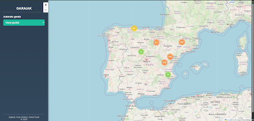
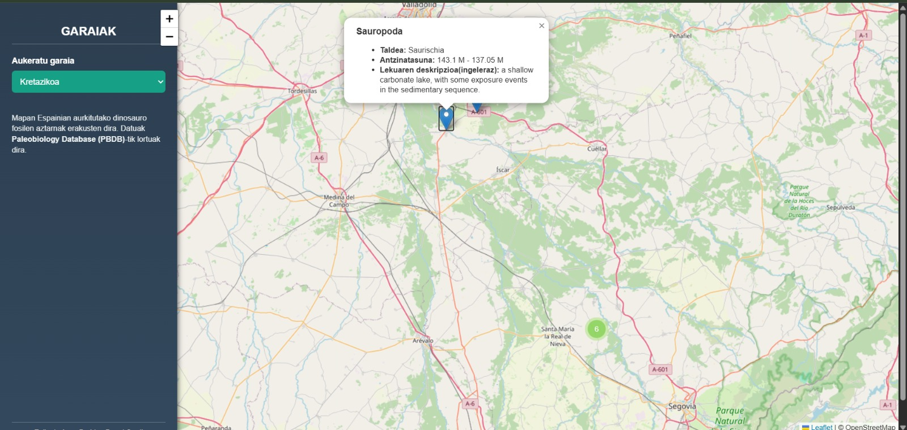
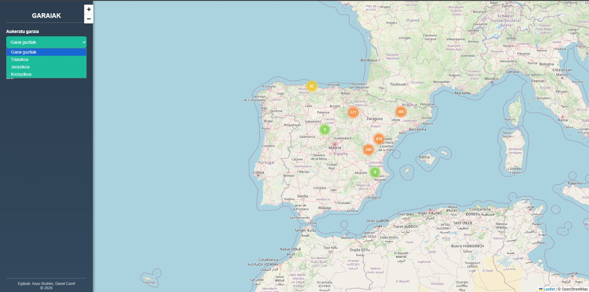

# 🦖 Dinosaurioak Espainian – Leaflet + PBDB

Proiektu honen helburua **Geolokalizazioa** irakasgaian ikasitakoa praktikan jartzea izan da, **Leaflet** mapa-liburutegia erabiliz eta **kanpoko API** baten bidez lortutako datuak geolokalizatuz.

Web aplikazio honek **Espainian aurkitutako dinosauroen erregistro paleontologikoak** erakusten ditu, **Paleobiology Database (PBDB)** API-tik eskuratutako informazioarekin.

---

## Helburua

- Leaflet erabiliz mapa interaktibo bat sortzea  
- API baten bidez datuak eskuratzea  
- Koordenatu geografikoak dituzten puntuak mapan kokatzea  
- Geolokalizazioaren erabilera praktikoa lantzea  

---

## Funtzionalitateak

- Espainiako mapa interaktiboa (OpenStreetMap + Leaflet)
- Dinosauroen aurkikuntza-puntuak markatzaileekin
- Marker Cluster sistema, puntu asko batera agertzean
- Alboko panela:
  - Garaiaren arabera filtratu
- Markatzaile bakoitzean informazio hau:
  - Dinosauroaren izena
  - Adina (milioi urtetan)
  - Garai geologikoa

---

## 🖼️ Irudiak

### 🗺️ Mapa interaktiboa

### 📍 Markatzaile baten informazioa

### 📊 Alboko panela eta estatistikak

---

## Erabilitako Teknologiak

- **HTML**
- **CSS**
- **JavaScript**
- **Leaflet.js**
- **Leaflet.markercluster**
- **Paleobiology Database (PBDB) API**

---

## API erabilera

Datuak **Paleobiology Database**-tik eskuratzen dira, parametro hauekin:

- Talde taxonomikoa: `Dinosauria`
- Herrialdea: Espainia (`cc=ES`)
- Informazioa: koordenatuak, taxonomia eta denbora geologikoa

---

## Erabilera

1. Ireki `index.html` fitxategia web-nabigatzaile batean  
2. Egin zoom mapan edo sakatu puntuak informazioa ikusteko  
3. Alboko panelean estatistika orokorrak kontsultatu  

Ez da beharrezkoa instalaziorik edo zerbitzari lokalik.
